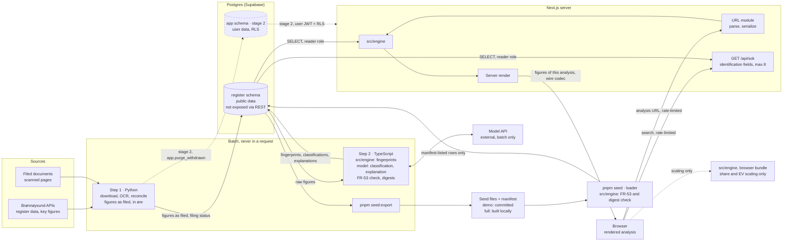

# Technical note: architecture — Peerless

Supplements the product brief. Data sources are documented separately in `docs/data-sources-brreg.md`.

---

## Guiding principles

**The engine calculates, the model explains.** The language model is used for two things: classification of business activity, and explanatory text. It must never perform arithmetic. The boundary is enforced in code and verified by an automated test that rejects generated text containing figures absent from the engine's output.

**Rules first, model on the remainder.** Where a problem can be solved deterministically, it is solved deterministically. The model receives only the cases the rules do not cover. Both layers are measured separately, and the difference between them is the project's central AI result.

**Authorization in the database, not in the code.** Row-level security means a fault in the application layer is not sufficient to leak data across users.

---

## Architecture invariants

The binding decisions that keep independently built parts consistent. Each has a stable id that stories cite; an id is never reused or renumbered. Everything else in this note is context or seed. Rationale is in the run log, `_bmad-output/planning-artifacts/architecture/architecture-Peerless-2026-10-10/.memlog.md`; the review findings each rule closes are in `reviews/` beside it. `[ADOPTED]` marks a decision the owner made or reality settled. Status: final, 2026-10-10 — AD-1 to AD-19 are all adopted.

**Paradigm: a batch-built read model.** Two batch steps build everything that can be computed ahead of a request and write it to Postgres. The request path reads, parses the URL, runs the pure engine and renders. In v1 nothing a user does writes to the database.

### AD-1 — One engine `[ADOPTED]`

- **Binds:** every derived figure — key figures, distributions, percentiles, kroner, fingerprints, default analyses, digests, the figures an explanation may cite.
- **Prevents:** two implementations of `docs/key-figures.md` drifting apart, and an FR-53 check run against an engine the user never sees.
- **Rule:** all arithmetic that produces a derived figure lives in `src/engine`, pure TypeScript with no database or framework imports. The Next.js server, the browser (closable-share and EV scaling only, AD-6), batch step 2 and the seed loader import it. Python never computes or stores a ratio, distribution or amount; its arithmetic only checks reconciliation (AD-15).

### AD-2 — Two batch steps, one writer per table `[ADOPTED]`

- **Binds:** ingestion, the seed, every table in the `register` schema.
- **Prevents:** two writers of one entity, and Python logic leaking into derived data.
- **Rule:**
  - Step 1 (Python, containerised) writes register data, API key figures, and document figures as filed with a per-filing status (AD-14, AD-15). It also deletes a company the register answers with `410 Gone` (FR-66); every step-2 table references the company `ON DELETE CASCADE`.
  - Step 2 (Node scripts in this repository, not a service) reads those and writes fingerprints, classifications, stored explanations and the covered-industry table. Default analyses are computed in step 2's memory, as inputs to explanations and the measurement; they are not stored, and the request path computes every analysis itself.
  - In a batch build each table has exactly one writing step. The seed loader (AD-16) is the one other declared writer: it writes only rows from manifest-listed files, runs FR-53 and the digest check (AD-13) at load, and is the only writer of a seeded database.
  - Neither step nor the loader runs in a request, and nothing a user reaches depends on any of them being up.

### AD-3 — Schema and grants `[ADOPTED]`

- **Binds:** all tables and roles.
- **Prevents:** data access decided by application code, and schema drift between the batch steps and the app.
- **Rule:** all DDL lives in `supabase/migrations`; the batch steps and the loader never run DDL. The one exception is `CREATE ROLE`, which lives in `supabase/roles.sql`, the CLI's place for cluster-level roles, with no password in it. Public data lives in the `register` schema; step 1, step 2 and the loader each have their own role — `ingest`, `derive` and `loader`, next to the request path's `reader` — with write grants only on the tables AD-2 gives them, each reached through its own `<ROLE>_DATABASE_URL`. `anon` and `authenticated` have no `USAGE` on `register`. User data (stage 2) lives in the `app` schema behind row-level security, with `is_anonymous` false required on every policy for saved or user-entered data. The boundary is database grants, not code.

### AD-4 — The read path `[ADOPTED]`

- **Binds:** every page and server function that reads public data.
- **Prevents:** harvesting the dataset around the rate limit through the public anon key.
- **Rule:** the `register` schema is not exposed through Supabase's REST interface. Next.js reads it server-side over a direct connection as a SELECT-only `reader` role, whose connection string never reaches the client (AD-19). v1 has no open JSON endpoints except the listed search endpoint (AD-12). Pages are rendered on the server, and the browser receives only the figures of the analysis it shows, embedded in the page: every peer's value behind each shown figure, excluded rows included. The service role is never used in a request.

### AD-5 — The URL is the only request state `[ADOPTED]`

- **Binds:** `/analyse/{orgnr}` and `/analyse/{orgnr}/{fane}` and their parameters: excluded peers, size-band step, closable share, EV/EBIT multiple (FR-69).
- **Prevents:** unvalidated input reaching the engine, and two parsers or writers disagreeing about the same address.
- **Rule:** one module, `src/url/analysis-state.ts`, exports `parse` and `serialize`. The server, client components and every link use it, and nothing else builds or reads an analysis URL. Its canonical grammar:
  - **Path:** `/analyse/{orgnr}/{fane}`, with `fane` one of `oversikt`, `peers`, `nokkeltall`, `verdi`. For a covered company `/analyse/{orgnr}` redirects to `oversikt`. For an uncovered company `/analyse/{orgnr}` is the result, and any `{fane}` redirects to it.
  - **Orgnr:** nine digits passing modulus 11. Anything else shows EXPERIENCE.md's malformed-number message.
  - **`ekskl`:** comma-separated orgnrs, sorted, de-duplicated, at most 20, each in the **candidate pool**: the companies left after funnel stages 1–3 at the current band step.
  - **`band`:** `0`, `1` or `2`.
  - **`andel`:** `0`, `25`, `50`, `75`, `100` or `median` ("Til medianen"). The server resolves `median` to the exact s_med; where none exists (r ≥ median) the token is invalid.
  - **`multippel`:** in (0, 50] in steps of 0.1, written with a point, read with a point or a decimal comma. The client field validators import the same bounds.
  - **Canonical form:** a parameter at its default is omitted, and `serialize(parse(url))` is canonical. "Default peer group" is a predicate on parsed state, not on the URL string.
- An invalid value falls back to its default in EXPERIENCE.md and raises its invalid-settings notice. This includes an exclusion outside the candidate pool and any exclusion beyond 20; nothing is dropped silently. Nothing else carries state in v1.

### AD-6 — Where recalculation runs `[ADOPTED]`

- **Binds:** peer adjustment, the closable-share control, EV, every exact value passed from a server component to a client component.
- **Prevents:** candidate data in the browser, and server and browser showing different amounts for the same URL.
- **Rule:**
  - **Server:** computes the peer group, distributions, full-convergence amounts and the exact s_med for the URL state.
  - **Peer changes:** exclude, restore, widen and reset are soft navigations, `router.push` to a URL from `serialize`, rendered on the server. While one is pending the previous figures stay dimmed. A failure keeps the last good URL and figures (EXPERIENCE.md, "Recompute").
  - **Share and EV:** the browser scales these with the same `src/engine` function and writes them with `window.history.replaceState`, never `router.replace`. Client components read them from `useSearchParams`. Every link and navigation builds on the current URL, so share and EV survive it. All URL writes go through one hook that serializes a single state object.
  - **Wire codec:** `src/engine/wire.ts` is the one codec for exact values sent to the browser. Values travel as full-precision decimal strings, never pre-rounded to øre and never as `number`. A branded `WireDecimal` type makes a `number` for money or a ratio a type error in client props. The server renders its own scaled amounts through the same round trip.
  - **Test:** a test asserts identical output from server and browser for the same wire values, run in Node and in a real browser engine.

### AD-7 — No model call in a request `[ADOPTED]`

- **Binds:** classification, explanation, FR-52, FR-53, FR-54, FR-73.
- **Prevents:** a key, a cost or a failure mode in the request path, and text that cites figures the user cannot see.
- **Rule:**
  - **Model:** in v1 it is called only from batch step 2, with the model id pinned in configuration, and the key exists only there. Each classification and explanation row stores the model id and a prompt hash.
  - **Coverage:** every 62.100 company has a stored explanation for its default peer group, built against the dataset it ships in. Outside the demo set it is built from the API figures present there.
  - **FR-53:** runs at generation and at seed load (AD-16).
  - **FR-54:** explanations explain and never recommend, enforced by test as well as by prompt. A phrase list kept in one reviewable file in the repository (for example `src/explanation/recommending-phrases.ts`) is checked at generation, where a hit means the explanation is regenerated, and at seed load, where a hit means it is withheld and reported, never shown. Before the demo seed is published, 30 random stored explanations are read and the result recorded in `docs/ai-sessions/`; any recommending phrasing the list missed is added to it.
  - **Display:** an explanation is shown only beside its default peer group, and only when its digest matches (AD-13). Otherwise the page shows EXPERIENCE.md's no-stored-explanation state.
  - **No network:** a test asserts that no request to the register or a model host leaves the app during an analysis (FR-73). Without a key the app runs on the stored output.

### AD-8 — Money and rounding `[ADOPTED]`

- **Binds:** the engine, the server render, the browser, the batch, the reader.
- **Prevents:** float error, and amounts that differ by a krone between places.
- **Rule:**
  - **Filed amounts** are integer øre (`bigint`, AD-14).
  - **Derived amounts and ratios** are exact decimals in **decimal.js 10.6.0**, pinned exactly: the one decimal library. `src/engine` exports the only configured constructor (`Decimal.clone`, with precision and rounding mode fixed there).
  - **Reading:** postgres.js returns `int8` and `numeric` as strings. They are parsed into `bigint` or `Decimal`, never through `Number()`. A `number` never holds money (AD-6).
  - **Rounding** happens only at display, in the one formatter (Consistency conventions), as `docs/key-figures.md` specifies, including its exceptions (whole-percent percentile, largest-remainder waterfall).

### AD-9 — Seed levels and dataset tags `[ADOPTED]`

- **Binds:** seed files, the loader, CI.
- **Prevents:** document-derived figures beyond the declared sample reaching the public repository, and a stale tag fooling the check.
- **Rule:**
  - **One dataset at a time:** one schema serves both levels, and a database holds one dataset at a time. `pnpm seed` and `pnpm seed:full` truncate and replace, and the loaded manifest records which dataset is loaded (AD-16).
  - **Tags:** document-figure rows, fingerprint categories and stored explanations carry a dataset tag recording which dataset produced the row. The tag is provenance only.
  - **Allow-list test:** a CI test reads every committed seed file regardless of tag. It fails on document figures for any orgnr not in the committed `seed/allow-list.json`: demo companies A, B and C, and A's and B's peers at all three band steps. `seed:export` writes the list and a reviewer approves it.
  - **Peer-group test:** a second test asserts that A's and B's computed peer groups at all three steps are subsets of that list.
  - **Idempotence:** loading a seed twice leaves the same state, under test (FR-73).
  - **Licence gate:** committing fingerprint categories waits for the licence gate (FR-73).

### AD-10 — Rate limiting without storing users `[ADOPTED]`

- **Binds:** every request surface in AD-12 in v1.
- **Prevents:** breaking "v1 stores no user data" by persisting IP addresses, and a surface that escapes the limit.
- **Rule:**
  - **Counters:** v1 limits requests per IP with in-memory counters held on `globalThis` in the single local server process.
  - **Choke point:** the limit is applied at one place, the Next.js proxy, matching every AD-12 surface, RSC payloads and soft navigations included. Search and analysis renders count in separate budgets, set in one config module.
  - **Refusal:** a refusal renders EXPERIENCE.md's refusal state with no figures.
  - **No IP stored:** no IP is written anywhere, logs included (AD-19).
  - **Run command:** the README runs `pnpm start`, not `next dev`.
  - **Limit of the design:** this does not hold across serverless instances, which is why persistent rate limiting is a gate before any public deployment.

### AD-11 — User data from stage 2 `[ADOPTED]`

- **Binds:** accounts, workspaces, saved analyses, own figures.
- **Prevents:** user data reached through the `reader` role, or through code that filters by user id.
- **Rule:** user data is read and written through Supabase with the user's own JWT, under row-level security, and never through the `reader` role or the service role. The only other writes into `app` are the functions in AD-17. The authorisation suite exists before the first feature that stores user data.

### AD-12 — The request surface is listed `[ADOPTED]`

- **Binds:** every HTTP surface the Next.js app exposes.
- **Prevents:** an unlisted endpoint escaping the rate limit or the "figures of this analysis only" rule, and a search that harvests financial data.
- **Rule:**
  - **Surfaces:** besides static assets, v1 exposes exactly these: `GET /`, `/slik-fungerer-peerless`, `/analyse/{orgnr}` and `/analyse/{orgnr}/{fane}` with their RSC payloads, and `GET /api/sok?q=`.
  - **Search:** `/api/sok` returns identification fields only: name, orgnr, primary industry (`naeringskode1`) and municipality. It returns at most 8 rows and never a financial field. It reads through `reader`, matches names with `pg_trgm` over an IMMUTABLE `unaccent` wrapper, matches orgnrs by an exact index, and sits behind the per-IP limit (AD-10).
  - **Server actions** are banned in v1.
  - **Test:** a test over the built route manifest fails on any surface not listed here.

### AD-13 — Stored derived rows carry a digest of their inputs `[ADOPTED]`

- **Binds:** stored explanations, fingerprint categories, classifications, the seed loader, the request path.
- **Prevents:** text or categories built from one engine or dataset being shown beside another's figures.
- **Rule:**
  - **Explanations:** each stores a digest of the exact engine output it was built from: the wire-encoded default analysis (AD-6) for that company and dataset. The request path shows it only when the current engine yields the same digest for that company and dataset. Otherwise it is hidden as missing. This is the one place "not shown" is decided: nothing writes a hidden flag, and there is no engine-version hard fail.
  - **Fingerprints:** each stores a digest of its raw inputs. They need no model, so step 2 rebuilds them in full on every run. A CI test recomputes them for the allow-listed companies from the committed figures and fails on a mismatch.
  - **Classifications:** each stores a digest of the description text it was made from. Changed text is reclassified on the next run.
  - **Digest function:** there is one, in `src/engine`.

### AD-14 — The raw-figure contract `[ADOPTED]`

- **Binds:** every amount column in `register`, step 1, the seed files, the reader.
- **Prevents:** a factor-100 or factor-1000 error between the writer and the reader of a raw figure.
- **Rule:**
  - **Columns:** every amount column in `register` is `bigint` øre, named after the register field with the suffix `_ore`, and a column comment states the unit. Nothing is stored as `numeric` or a float.
  - **Reporting unit:** step 1 resolves each filing's reporting unit (kroner, thousands or millions) and converts to øre before writing. The unit is stored per filing for provenance.
  - **Contract test:** a test runs step 1's writer on a fixture filing (979607008, 2025) against a freshly migrated database and asserts hand-checked øre values. This test is also step 1's schema contract.

### AD-15 — Figures are stored as filed, with a status `[ADOPTED]`

- **Binds:** step 1's output, the engine's input and output types, the renderer.
- **Prevents:** two derivations of one component, and a missing value rendered as the wrong absence or as zero.
- **Rule:**
  - **Stored as filed:** step 1 stores each figure as filed (øre, or NULL for an empty element) with its stated totals. It may derive internally to check reconciliation, but never stores a derived value. Derivation of missing components lives only in `src/engine`.
  - **Per filing:** each filing stores its filing year (from `regnskapsperiode`), read date (AD-18) and reporting unit. It also stores a status (`reconciled`, `failed_reconciliation`, `not_extracted` or `paper`) and the result of each check.
  - **Absence reasons:** the engine's types name every reason a value is absent:
    - not in this dataset (the orgnr has no document figures in the loaded manifest);
    - failed reconciliation (FR-71);
    - undefined (FR-23);
    - below the floor (FR-22).
  - Each reason maps to exactly one EXPERIENCE.md state, and none is inferred from a missing row.

### AD-16 — One seed path, with a manifest `[ADOPTED]`

- **Binds:** `pnpm seed`, `pnpm seed:full`, `pnpm seed:export`, the loader, `supabase/config.toml`, migrations.
- **Prevents:** a second producer of seed files, a load that skips FR-53, and a seed that does not match the schema.
- **Rule:**
  - **One hand-off:** Postgres is the only hand-off between batch steps.
  - **Producing and consuming:** seed files are written only by `pnpm seed:export`, deterministically (sorted, stable formatting), and read only by the loader. `pnpm seed:full` runs both steps, exports to a gitignored path and loads through the same loader.
  - **Manifest:** each seed carries a manifest recording:
    - the manifest (seed-format) version;
    - the latest migration id;
    - the dataset, `demo` or `full`;
    - the orgnrs with document figures;
    - the read-date range;
    - each file with its checksum.
  - **Load checks:** the loader refuses a manifest whose version or migration id does not match, and any file that is unlisted or fails its checksum. The loaded manifest is stored as one row in `register.dataset`.
  - **Explanations at load:** the loader checks each explanation against the loaded dataset, by FR-53 and by digest (AD-13). It writes only those that pass and reports the rest.
  - **CLI and CI:** Supabase CLI auto-seeding is disabled in `supabase/config.toml`. CI migrates a fresh database and loads the committed demo seed.

### AD-17 — One path from batch into `app` (stage 2) `[ADOPTED]`

- **Binds:** FR-66 in stage 2, and every write to `app` not made with a user's JWT.
- **Prevents:** a batch holding the service role, a withdrawn company surviving in saved work, and an anonymous session writing a table.
- **Rule:**
  - **Purge:** `app.purge_withdrawn(orgnr)`, a `SECURITY DEFINER` function in a migration, is the only path from batch into `app`. Only step 1's role can execute it. It is audit-logged with a system actor and performs exactly FR-66's subject and peer edits.
  - **Other system writes** (the audit log, the description-classification cache, rate-limit counters) likewise go only through named `SECURITY DEFINER` functions in migrations. The description cache is keyed by a hash of the text and scoped to the session.
  - **Tests:** the authorisation suite asserts that `anon` and `authenticated` cannot call `purge_withdrawn`, and that an anonymous JWT cannot insert into any `app` table directly.

### AD-18 — Data time `[ADOPTED]`

- **Binds:** step 1, export and load, the engine, the renderer.
- **Prevents:** a read date overwritten by the load time, a clock in the engine, and server and browser showing different dates.
- **Rule:**
  - **Read date:** step 1 stamps `read_at timestamptz` per filing at fetch, and export and load preserve it.
  - **Filing year:** taken from the returned `regnskapsperiode`, never from the requested year.
  - **No clock in the engine:** the benchmark year is derived from the subject's latest filing.
  - **Formatting:** dates are formatted on the server only, in `Europe/Oslo`.
  - **Refresh:** a manual batch run (FR-64).

### AD-19 — Config, secrets and logs `[ADOPTED]`

- **Binds:** environment variables, role credentials, the server logger, error rendering, the client bundle.
- **Prevents:** a secret in the client bundle or the repository, an IP in a log, and a failure rendered as partial figures.
- **Rule:**
  - **Environment variables:** every one is server-only. **In v1 no `NEXT_PUBLIC_` variable exists**, and a CI grep fails on any. **From stage 2** the check allows exactly `NEXT_PUBLIC_SUPABASE_URL` and `NEXT_PUBLIC_SUPABASE_ANON_KEY`, listed by name, for browser sign-in — nothing else. `.env.example` mirrors this: the two stage-2 entries are present but commented out. `READER_DATABASE_URL` is read only in `src/server/db.ts`, which starts with `import 'server-only'` and holds one postgres.js client per process. The model key is read only by step 2.
  - **Imports:** an ESLint `no-restricted-imports` rule forbids `src/server/**` and `postgres` in any `'use client'` module and in `src/engine/**`.
  - **No secret to run v1:** every local value is a Supabase CLI default or optional, documented in `.env.example`. Role passwords are set from `.env` and never committed.
  - **Logs:** one server logger module writes structured logs with no IP address and no personal data. Nothing logs request headers.
  - **Errors:** an error in the request path renders EXPERIENCE.md's lookup-error state, with no partial figures.

**Dependency direction.** `src/engine` depends on nothing in the project. The URL module depends only on the engine. The Next.js app, batch step 2 and the seed loader depend on the engine. Batch step 1 depends on neither. The browser reaches data only through the rendered page and `/api/sok`.

**Consistency conventions.**

| Concern | Convention |
|---|---|
| Display formatting | `src/engine/format.ts` is the only formatter. It takes decimal strings and pins its separators and minus sign explicitly rather than trusting the ICU. The server render, the browser, step 2's prompt builder and the FR-53 checker all use it. |
| Covered industries | `register.covered_industry` is written by step 2. Code and copy read it, and the literal `62.100` appears in no application code. |
| Fingerprint shape | One type, in `src/engine/fingerprint.ts`, with the five FR-73 categories (inventory, cost-of-goods band, capitalised intangibles, asset-intensity band, personnel-cost band). A migration check mirrors it. |
| Batch status | Classification status is one of `classified`, `no_text`, `failed` or `pending`. `seed:export` refuses to run while a covered-industry row is `failed` or `pending`. Each batch run writes a run record: start, end, counts per status, model id and prompt hash. `pnpm seed` prints it. |
| Model provenance | Each classification and explanation row stores the model id and a prompt hash (AD-7). |
| Errors and logs | See AD-19. Batch failures are written to the run record, never swallowed. |

**Stack (seed, verified 2026-10-10).**

- **Runtime:** Node 24 LTS (`.nvmrc` 24.21.0).
- **Framework:** Next.js 16.4 (App Router; pin the patched 16.4.x due 2026-10-14), with Cache Components off. React 19.3. TypeScript 6.x, strict.
- **UI:** Tailwind 4.3, shadcn 4.21 and Recharts 3.10.
- **Package manager:** pnpm 12, pinned through `packageManager`.
- **Database:** Supabase CLI 2.120, pinned exactly. Local Postgres 17 with `pg_trgm` and `unaccent` for name search.
- **Reader connection:** postgres.js 3.4.9, no ORM, in a `server-only` module. It returns `int8` and `numeric` as strings, never passed through `Number()`.
- **Decimal library:** decimal.js 10.6.0, pinned exactly (AD-8).
- **Step 1:** Python 3.14 (`.python-version`) with `uv` from a pinned image tag and a committed `uv.lock`. Tesseract 5.5 with `nor` from `tessdata_best`, pinned by commit, in Docker.

**Deferred, with the reason it can wait.**

- **Hosted deployment** (Vercel, hosted Supabase): v1 runs locally from the README. It arrives with stage 2, behind three gates: the licence assessment, persistent rate limiting, and a refresh cadence.
- **Render caching:** Cache Components is off in v1, and every analysis renders dynamically from the URL. It is revisited with the stage-2 deployment. Any cache then keys on the canonical parsed URL state (AD-5) and the loaded manifest (AD-16), and every seed load invalidates it.
- **Automatic refresh cadence:** v1 refreshes manually and shows the read date (AD-18). A cadence shaped to the filing window is a gate before any public deployment.
- **Test runner and CI provider:** chosen in the first setup story. The ADs and "Test strategy" name the tests that must exist, not the tool, and AD-6's identity test needs a real browser engine.
- **Embeddings** (pgvector): computed in batch step 2 for the measurement only, never user-facing, and the first v1 item cut if time runs short.

---

## Data ingestion

**Bulk download.** Company data and key figures are loaded in bulk per industry. This is free and fast, and covers the first three stages of the funnel.

**Documents are extracted ahead of use, not on demand.** OCR takes seconds to tens of seconds per filing, so it cannot run inside a user request. A batch job pre-warms every covered industry before they are available in the product, and the result is stored permanently. Lazy on-demand extraction was the original design; it is not viable once extraction means OCR.

This bounds the cost by the size of the covered industries rather than by the register, which is why coverage is added industry by industry, each only once it is measured.

**The subject of the analysis** is always extracted in full detail across several years, since it is a single company.

**History is fetched every other year**, because each document carries a prior-year column.

**Licence obligations sit on the ingestion job and on the interface.** The open APIs are NLOD 2.0, which permits commercial use, modification and redistribution, and requires the source and licence to be credited and any modification declared — every figure shown is recomputed, so that declaration applies. The register also states that an entity returning `410 Gone` should be treated as a request that copies and caches remove it, so the batch job deletes a withdrawn company rather than flagging it. Saved analyses are a record of what was computed on their stated read date, with this one exception: as subject, the withdrawn company's figures are removed and the workspace keeps only a notice; as peer, its row and name are removed while already-computed aggregates are kept with a note that one peer was removed. No data about the entity survives anywhere (PRD FR-66). One gap is open and is a gate before any public deployment, not a v1 blocker: the register licences the key-figures API but not the filed documents, and twelve of the fifteen key figures come from those documents. Clause references and URLs are in `docs/data-sources-brreg.md`.

---

## Document extraction

**The filed documents contain no text layer.** Every page of every filing served by the register is a single full-page raster image — verified on 264 pages across all 15 available years for the primary test company. There is no rule-based text extraction path, because there is nothing to parse. Full evidence in `docs/data-sources-brreg.md`.

Extraction is therefore an OCR pipeline: render the page at high resolution, recognise words with their bounding boxes, group them into rows and columns by position, then parse the numbers. Extraction targets the Brreg-generated section, which is three pages with a layout identical across all companies. That fixed layout is what makes this tractable — column boundaries are calibrated once and reused, rather than inferred per document.

**Every extracted figure is checked twice, under two different rules, and neither is exact equality.**

*Within* the document, a tight absolute bound of a few kroner. The register presents whole kroner rounded from underlying øre, so a stated subtotal can legitimately differ from the sum of its components by a krone — verified on three subtotals in the primary test filing. Demanding exactness would reject valid filings.

*Between* sources — the document against the API's key figures — a proportional tolerance, because companies reporting in thousands or millions introduce real scaling error.

The distinction matters because the two error scales are so far apart. The filing's own rounding is a krone or two; recognition errors observed in the feasibility spike were wrong by orders of magnitude. An absolute bound of a few kroner admits the former and catches the latter, while a proportional tolerance would hide both.

A failure blocks the filing rather than degrading the analysis silently.

**The data quality flag is derived from these arithmetic checks, not from recognition confidence.** A generic engine reported mean confidence 0.974 on these pages while misreading several figures; confidence is not a signal here.

**A first feasibility measurement exists and the premise holds.** On a recent filing, untuned and with a generic engine, 11 of 14 authoritative figures were recovered exactly, and position-based row grouping reconstructed label-to-value rows correctly across both year columns. All remaining failures were digit assembly rather than recognition, which is code we control. Detail and headroom in `docs/data-sources-brreg.md`.

**The older filings are measured, and the answer is five years.** Paper filings have no generated section and are never read; they are a small remainder before 2014. The generated section keeps its fixed layout back to 2011. Read twice — plain, then digits-only where the plain read gave nothing — and kept only where it reconciles, about 88 % of columns verify for 2021–2025 and about 60 % for 2011–2016, with 71 of 71 figures agreeing with the key figures API. Development over time, from stage 2, therefore covers 2021–2025. Older generated years are used where they reconcile, not promised. Detail in `docs/data-sources-brreg.md`.

---

## Industries covered first

**v1 covers 62.100 Dataprogrammeringstjenester only**, as the teacher's feedback of 2026-10-06 recommended: start with one industry, get the core flow working and measured there, and add industries later. 69.202 Regnskapsføring og bokføring and 43.210 Elektrisk installasjonsarbeid are screened (`analysis/output/industry-screening.md`) and come in stage 3, each offered only once its own measurement exists.

62.100 is where classification has most to prove. With five or more employees there are about 1 000 companies, and their operating margins run from −46 % to +9 % between the first and third quartile. Loss-making product companies and profitable consultancies share one code. In stage 3, 69.202 is the natural control — about 800 companies, 93 % describing core bookkeeping, margins within 12 points — and comparing the two shows *when* the model earns its place, not only that it does. 69.202 is also the primary user's own industry.

43.210 would follow: the largest population, and the only one where receivables and inventory put the OCR-derived ratios to work.

---

## Peer group — a five-stage funnel

1. **Coarse filter**, rules. Industry code and size band — `sumDriftsinntekter` from the same filing as the figures being compared, by default 0.5 to 2 times the subject's, loosenable one fixed step at a time to 0.33 to 3 times and then 0.25 to 4 times. Revenue, never `sumEiendeler` and never the register's employee count, which is today's figure rather than the accounting year's. Hundreds of thousands → a few hundred.
2. **Comparability filter**, rules. Currency, accounting rules, `smaaForetak`, `avviklingsregnskap`, accounting period, `regnskapstype`. All exposed as fields in the API.
3. **Segmentation**, rules. Size, legal form, geography where the industry calls for it. → under a hundred.
4. **Business-model fingerprint**, rules. Reads what kind of business a company is from its own accounts: cost of goods sold as a share of revenue, whether it carries inventory, capitalised intangible assets such as self-developed software, fixed-asset intensity, with cost of goods share and personnel cost share in coarse bands. A reseller, a product company and a consultancy separate here even when all three describe themselves as "Programvareutvikling." Works for every company whose accounts are extracted.
5. **Classification**, model. Reads the company name, secondary industry codes, the statement of purpose and the business description, and judges whether the candidate is the same type of business. Where the text and the fingerprint disagree, the candidate is flagged rather than resolved by either. A company with nothing to classify on is stored as unclassified, not guessed at, and can still be a peer on stages 1–4.

**Never select on what is being benchmarked.** If peers were chosen for having a similar margin, every margin gap would be close to zero and the analysis would show nothing. The fingerprint therefore uses only features that say *what kind* of business a company is, never *how well* it is run: no margins, returns or productivity. Cost of goods share and personnel cost share are both business-model markers and benchmarked ratios, so they enter selection only in coarse bands and are benchmarked within the band. That is a deliberate trade-off, recorded under decision points.

**The subject can be described by the user (stage 2).** The subject is the one company whose classification matters most, and the user knows what it does. An optional sentence entered by the user takes precedence over the register's description for the subject. It belongs to the workspace, and for anonymous sessions it is used for that analysis and not stored. It is sent to the model only to classify, and the model can answer only with fixed categories, so text written to steer the model cannot change more than the category it lands in.

Classification runs once per company at ingestion, in batch step 2 (AD-7), never at search time. The one exception is a description the user enters for the subject: it is classified once, when entered, and the result is cached against that text and rate-limited with the open route. No peer is ever classified at search time. Each company is stored with a structured profile: what it does, B2B or B2C, manufacturing, trade or services, capital intensity. A search then becomes an ordinary database query.

Each peer's inclusion reason is generated deterministically from the profile fields it shares with the subject, and states what the match rests on: description and accounts, accounts alone, or industry and size alone. The model classifies; it does not write the justification.

**Measured layer by layer.** Each stage is scored against the labelled set on its own and in combination: industry code and size alone; adding the fingerprint; adding text through embeddings (stored with pgvector in the same Supabase Postgres, no separate vector service); adding text through model classification. The report then shows where the improvement comes from, not only that there is one. If the fingerprint alone captures most of it, that is a finding: the model was needed less than expected. Embeddings replace classification only if they measurably beat it.

The user sees how many companies remain after each stage and can loosen a criterion when the group becomes too small.

---

## Calculation engine

Every key figure, its source, direction and translation to kroner is defined in `docs/key-figures.md`; the engine implements exactly that document.

Pure functions with no dependency on the database or the framework. Figures in, figures out. Tested in isolation against reference cases with hand-calculated expected values.

Money is handled as integer øre for filed amounts and exact decimals (decimal.js) for derived ones, never floating point (AD-8). Missing components are derived here and only here (AD-15).

Non-calendar and changed financial years are excluded by the comparability filter (FR-8); nothing is adjusted.

---

## Pages

**Front page.** A short description of Peerless, the search field (company name or organisation number, searched in the seed database and never the register live), "Slik fungerer det" in three steps and a link to the About page. From stage 3, below it, an overview of each covered industry: the median margin over time, the spread in personnel cost share, the share of companies growing. Overviews show aggregates only, never named companies, are computed by the same engine from the same stored figures, and follow the minimum group size. Named rankings are out of scope: a top list collects recognition errors and small-base outliers, and a wage-share ranking misleads wherever subcontractors are booked outside payroll. Stage 3 also shows industry context from Statistics Norway (SSB) — market size, growth and profitability over time — as context only, never mixed into the peer benchmark.

**Analysis tabs.** Overview, peers, key figures and gaps, and value in v1; development over time joins them in stage 2.

**About page**, "Slik fungerer Peerless" (v1): how peers are chosen, where AI is used and that it never calculates, what has been measured, the data sources and licence, and the limitations.

**Portfolio front page (stage 2).** A signed-in user's front page lists every company they follow — that is, every company with a saved analysis in one of their workspaces — with its latest position, what has changed since the last filing and the largest gaps. It reads saved analyses only. User-arranged widgets are deferred.

---

## Access control

**Anonymous sessions (stage 2).** In v1 there is no sign-in of any kind. From stage 2, a visitor without an account gets a Supabase anonymous sign-in, so every request still carries a real `auth.uid()`. There is one access model, not two: row-level security, the audit log and rate limiting all work unchanged. When the visitor registers, the anonymous user is converted in place and keeps what it did.

**What an anonymous session changes lives in the URL** — organisation number, active tab, excluded peers, the size-band step, the closable share, the EV/EBIT multiple — and not in the database. No anonymous session writes to any table, which is what lets the `is_anonymous` rule below hold without exception, and the address reproduces the same analysis when refreshed, bookmarked or passed on. Everything carried this way is either public register data or the user's own choice of parameter; a workspace identifier or an unfiled figure must never be allowed into it. This is not browser storage. And because a URL is user input, every value in it is validated on each request rather than trusted for having come from a link the product itself generated. At registration the URL state is written into the new workspace — that write is what conversion in place actually consists of.

**The trap:** anonymous users hold the `authenticated` Postgres role. A policy that only checks for an authenticated user admits them. Every policy on saved or user-entered data must also require `is_anonymous` to be false in the JWT, and the authorisation tests include an anonymous attacker.

**Workspaces.** Saved work belongs to a workspace. Membership carries a role, `owner` or `viewer`. Row-level security keys every user-scoped table to workspace membership. An adviser is a user with many workspaces; there is no adviser role.

**Invitation** is by email, into a single workspace, as viewer. Share links are out of v1.

**The account wall applies from stage 2.** v1 has no accounts and stores no user data; every analysis is open and read-only. From stage 2: open to anyone: the front page and industry overviews, lookup, the peer group and its adjustment, key figures, percentiles, gaps in kroner, the closable-share control and valuation, and a five-year sparkline per key figure, always drawn with the peer median as a faint reference line, as a preview. Needs an account: the full development-over-time view, the decomposition views, PDF export, saved analyses and history, unfiled figures, workspaces, invitations and the portfolio front page.

**A user's own unfiled figures** live in their own table, keyed to a workspace. The owner writes, viewers read, anonymous sessions never read. Aggregate queries read only the tables holding filed accounts, so leaking unfiled figures into a peer median would require changing the query, not forgetting a filter. Removing a member revokes access immediately, since every policy goes through membership. When the filing for the same year arrives, it takes precedence and the user-entered figures are kept only as history.

**Year-to-date entry** follows the same rules with one added: the owner states how many months the figures cover, **nothing is annualised**, and only ratios are produced — a kroner amount would need a twelve-month revenue base. The primary comparison is the owner's own same period in the previous year, entered by them, which is what makes seasonality largely cancel; the company's last filed full year and the peer distribution are shown as whole years and labelled as such. Because nothing is scaled, the engine's rule that no figure is ever estimated holds without an exception, and so does the exclusion of forecasting from scope.

**Minimum group size: 10 peers** before any aggregate is shown, counted per key figure after companies with an undefined value are left out. Below the floor the row persists with the company's own value, and the aggregate cells report how many comparable values exist against the ten required, so a thin figure is visible as thin rather than missing. This is a quality threshold, not a confidentiality control: aggregates are computed only from public filings.

**The open route** is rate-limited per IP from v1, and per session with a CAPTCHA on anonymous sign-in from stage 2, to stop register harvesting. The explanation text depends only on public figures and the peer group, so it is generated once for the **default** peer group and cached, rather than produced per visit. In v1 an adjusted peer group hides the text and says it belongs to the standard peer group, with an action that restores that group, so the explanation is only ever shown beside the figures it describes. A signed-in user can regenerate it for an adjusted group behind a rate limit; an anonymous session never triggers generation at all.

**The audit log** is append-only, with actor, timestamp and prior state. Anonymous actors are logged by their anonymous id.

---

## Running Peerless locally

A sensor must be able to run Peerless from a fresh clone without our keys.

**Database.** The Supabase CLI runs Postgres and auth locally in Docker (`supabase start`). Every table and policy is a migration in the repository.

**Seed data, in two levels from the start.** The batch steps write to Postgres, and `pnpm seed:export` turns that database into seed files with a manifest — register data, key figures, document figures as filed with each filing's status, fingerprint results, AI classifications and stored explanations; the loader is the only way back in (AD-16). Running the app never needs OCR, the register API or a model. Because the register states no licence for the filed documents and the repository is public:

- **demo**, committed and loaded with `pnpm seed`: register data, API key figures and AI classifications for all of 62.100; **fingerprint results for every 62.100 candidate** — the derived categories inventory yes/no, cost-of-goods band, capitalised intangibles yes/no, asset-intensity band and personnel-cost band, never the document figures behind them — so stage 4 runs for any 62.100 subject; and **full document-derived figures for the three demo companies and every peer of A and B at all three size-band steps**, so widening the band on A or B still gives a complete analysis. **A** is a typical 62.100 consultancy with its full peer group — the whole analysis. **B** is a loss-making 62.100 product company — the fingerprint separating product from consultancy, and a large gap. **C** is a 69.202 bookkeeping firm — the "not yet covered" state, from API figures alone. Every other 62.100 company gets the full funnel and a peer group, compares its API figures as normal, and shows its own document-based figures — and any figure needing its peers' document figures — as "Ikke i demodataene", with a note that `pnpm seed:full` builds the full set. "For få sammenlignbare" stays reserved for genuine below-floor cases.
- **Licence gate.** Before the demo seed is first published, a short licence assessment is recorded in the repository, assessing whether committing derived categories is low risk compared with reproducing document figures. The gate opens only if the assessment concludes so; otherwise the fingerprint categories are not committed.
- **full**, generated locally by the pipeline in Docker with `pnpm seed:full` (hours), never committed while the filed documents' licence is unresolved.

Adding an industry later is the pipeline, a measurement and a seed refresh — no app or schema change.

**AI in test mode.** No request calls a model (AD-7). The demo seed carries a stored explanation for every 62.100 company's default peer group, generated against the demo dataset, so without an API key the app shows the same text. The figure-validation test runs against those fixtures and again when a seed is loaded, and the request path shows a text only while its digest matches the current engine output (AD-13).

**Rate limiting** in a local run is an in-memory per-IP counter that stores nothing (AD-10).

**Configuration.** No secret is needed: local values are Supabase CLI defaults or optional, listed in `.env.example`, and role passwords are never committed (AD-19).

**No email in v1**, since there are no accounts.

**README.** Clone, `supabase start`, install, `pnpm seed`, run — five commands — and the three demo organisation numbers with what each demonstrates.

---

## Test strategy

**Authorization tests** are written as soon as stage 2 introduces user-scoped data, before any feature that stores it. They attempt every forbidden access pattern and expect rejection: across workspaces, including those held by the same owner; reading another user's data; an anonymous session reading or writing saved data; a viewer writing; an invited viewer reaching a workspace they were not invited to; calling an endpoint unauthenticated; and calling `app.purge_withdrawn` or inserting into an `app` table as `anon` or `authenticated` (AD-17).

**Reference cases** for the engine: real filed accounts with hand-calculated expected values, including edge cases — negative equity, zero revenue, missing components, and a non-calendar financial year, asserted as excluded (FR-8).

**OCR accuracy, measured against a hand-transcribed set.** For a sample of filings, every figure in the generated section is transcribed by hand, and the pipeline's output is compared against it field by field. Reported as the share of figures recovered exactly, and separately as the share of filings passing the internal consistency check, split between recent filings and older scans. This is the measurement that decides which document-derived ratios the product can honestly offer.

**A labelled classification set**, to a stated sampling frame and started in week 1: **30 subject companies in 62.100, 30 candidates each, drawn at random from the subject's size band rather than from the funnel's output** — about 900 judgements. Drawing from the band and not from the funnel is what gives recall a denominator, since a genuine comparable the funnel never proposed then counts against it. Stratified by description quality, so precision and recall are reported separately for informative and uninformative descriptions, and reported per layer of the funnel. With one industry the result says whether the model adds anything within 62.100; the contrast with a homogeneous industry comes with stage 3. An industry is offered in the product only once its own measurement exists. Fallback if the set comes in small: pool the description cohorts, stated as a smaller claim rather than a quiet one.

**What the measurement claims, and what it cannot.** The headline is the **layer-by-layer ablation** — how much each layer adds, and whether the model adds anything beyond the accounts-based fingerprint. That can come back "no". The comparison against industry code alone is a **sanity check, not the claim**: the labeller judges comparability on the criteria the fingerprint encodes, so industry code is expected to lose, and blinding to funnel stage removes provenance bias rather than that circularity. Three partial defences, all reported: the rubric is written and dated before the fingerprint's feature list is fixed; a subsample is labelled from description and website only, blind to the accounts; and a second labeller judges about 50 pairs with Cohen's κ reported.

**Synthetic cohorts** at and below the minimum group size, to test that no aggregate is shown below it.

**An automated test** that rejects generated text containing figures outside the engine's output.

**Tests the PRD and the ADs make load-bearing**, each written in the story that builds its unit:

- FR-30: the two-cluster no-double-counting assertions. FR-21: the two exact identities.
- FR-13: the per-industry within-band spread test. FR-18: no loosening step admits a comparability failure.
- FR-73: no request to the register or a model leaves the app during an analysis (AD-7); loading the seed twice leaves the same state (AD-9).
- AD-6: server and browser give identical output from the same wire values, in Node and in a real browser engine.
- AD-9: the tag-blind allow-list test and the peer-group subset test. AD-13: recomputed fingerprints for the allow-listed companies.
- AD-12: the route-manifest test. AD-14: step 1's contract test against a migrated database. AD-16: CI migrates a fresh database and loads the committed demo seed.

---

## Stack

**The application:** Next.js and TypeScript. Supabase for PostgreSQL, authentication and row-level security, with pgvector for embeddings. An LLM API for classification and explanation, called only from batch step 2 in v1 (AD-7).

**The ingestion pipeline, in two batch steps** (AD-1, AD-2). Step 1 is Python, managed with `uv`: it loads company data and key figures in bulk, renders and OCRs the filed documents, reconciles them and writes the figures as filed, in øre, with each filing's status (AD-14, AD-15) — it never computes a ratio. Tesseract requires a system binary, so step 1 is containerised; this is also what makes it reproducible outside the machine it was written on. Step 2 is Node scripts in this repository: it uses `src/engine` to compute fingerprints and, in memory, default analyses, calls the model for classification and explanation, and runs the figure-validation test against the same engine.

**The boundary between them is deliberate and it is not a matter of taste.** Neither batch step serves a user request; both write to Postgres and are never in the request path. Everything a user can reach goes through Next.js. In v1 it reads public data server-side as a SELECT-only role (AD-4); from stage 2 the user's own token reaches the database for user data and row-level security enforces access (AD-11).

That is the whole rationale. Authorization is what this project is assessed on most strictly, and row-level security is a stronger guarantee than per-endpoint checks because a fault in the application layer is then not sufficient to leak data. Introducing a second request-serving service would mean forwarding the user's identity through it correctly on every path — and getting that wrong once means queries run with the service role and row-level security is silently bypassed. Python is used where it is genuinely the better tool, which is OCR and document processing, and nowhere that weakens that guarantee.

---

## Performance targets

Peer group assembly under one second, since it reads stored key figures and profiles.

A complete analysis under a few seconds, because it reads stored figures for every company involved — the subject included. The subject must be in a covered industry to receive a **peer analysis**, and covered industries are fully pre-warmed, so no recognition happens at query time. An uncovered company is not turned away empty-handed: it is shown the three API-sourced key figures from the register's latest-year summary — operating margin, return on assets, equity ratio — with no peer group and no comparison of any kind. The twelve figures needing a document component are simply absent, because nothing has been extracted for that industry and extraction never runs during a request. No documents are fetched or OCR'd during a user request, for the subject or for peers. In v1 no model call is reachable from a user request. Stage 2 adds exactly two: classifying a user-entered subject description, once per text and cached against that text; and a signed-in user regenerating the explanation for an adjusted peer group. Both are rate-limited, and regeneration additionally requires an account. Peer group assembly triggers neither.

The OCR pipeline has no interactive budget. It runs as a batch job and is measured on throughput and accuracy, not latency.

---

## Schedule

Thirteen weeks.

| Week | Content |
|---|---|
| 1 | Project setup: Next.js, local Supabase, migrations, seed loader, CI. Labelled set and hand-transcription start |
| 2 | **First working analysis page:** organisation number → API figures → peer group (funnel stages 1–3) → table |
| 3 | Calculation engine per `docs/key-figures.md` with reference cases; kroner gaps and the closable-share control |
| 4–5 | OCR pipeline into the seed data, the two reconciliation rules, data quality flags |
| 6 | Fingerprint and classification for 62.100, stored; "Hvorfor med" and match basis |
| 7 | Explanation layer with AI test mode and the figure-validation test |
| 8 | Layer-by-layer measurement against the labelled set |
| 9 | Final check at 320 px, About page, README, a run from a fresh clone |
| 10–12 | Stage 2: accounts, workspaces, row-level security and the authorisation suite, development over time, own figures, PDF |
| 13 | Report and documentation |

**Phone width is checked in every UI story**, at 375 px and the 320 px floor (EXPERIENCE.md, Foundation), as part of its acceptance; week 9 only repeats it across the whole product.

**The OCR question was answered before week one.** Five years of development over time, paper filings never read, older generated years where they reconcile. What remains is exact accuracy against a hand-transcribed set, which runs alongside the code.

**Two pieces of manual work start early and run alongside the code**, because they are calendar work rather than coding work and they are what the project's results rest on: the hand-transcribed OCR reference set, and the labelled classification set. Deferring either to the week it appears in the table above is how they end up too small to report.

**If time runs short:** stage 3, then stage 2 from the end of its list, then embeddings — which is why the measurement reports three layers without them and four with. v1 is not cut. Never the labelled set, the OCR measurement, or — once stage 2 stores user data — the authorisation suite.

Requirements that carry a success metric are load-bearing for the graded result; the rest are product. The cut order draws from the product group first by design, and the single exception is development over time, which the OCR measurement covers and where only the interface is cut.

**Workflow from the first line of code.** Planning documents may be committed straight to `main`; code goes through one GitHub issue, one branch (`story/<id>-<slug>`) and one pull request per story, with the PR linking the issue, the FRs, the test evidence and the AI session file, and recording what review found in AI-generated code. The grading guide looks for branches, pull requests, issues and traces of code review, and this is where they come from. Detail in `AGENTS.md`, "Git workflow".

**AI sessions** are saved in `docs/ai-sessions/`, one file per working session, linked from the PR or commit it produced.

**An AI log** (`docs/ai-log.md`) is kept from week one: what was asked for, what came back, what was wrong, how it was caught. Particular attention to authorization checks proposed in the client rather than on the server, floating point applied to money, and parsers that read an empty element as zero.

---

## Course requirements — IBE160

Kept out of the product brief, which follows the template provided. Collected here for internal use.

**Difficulty: hard.** Four processing stages with a defined data flow, integration against external public APIs, extraction from documents, a statistics engine computing distributions over dynamically assembled groups, a model-based classification stage whose accuracy determines the result and is measured against a baseline, an open anonymous route that must resist harvesting while sharing one access model with registered users, per-workspace roles with invitation and isolation between workspaces, and database-enforced multi-tenancy.

**Security/login: no accounts in v1, by decision.** Following the teacher's feedback of 2026-10-06, v1 has no accounts: the filed figures are public, and v1 stores nothing about its users. v1's security is input validation, secrets kept server-side, a rate-limited open route and no stored user data. Login, workspaces with roles, row-level security and the authorisation suite are the first items of stage 2 — protecting what the solution then adds on top of the public figures: the user's unfiled figures, activity and saved analyses, which reveal strategy for an investor and a client list for an adviser. In stage 2: anonymous sessions separated from registered users within one access model, per-workspace roles with isolation enforced by row-level security, invitation by email, an audit log, and automated authorization testing. The grading guide does not require login; its criterion 2 counts several user roles, which stage 2 delivers.

**Online purchase/sale: no.** Not within the scope of this version.

**Data in.** Key figures from filed annual accounts and company data — industry code, employees, registration date, business description — from public registers. Annual accounts as documents. The user's own unfiled figures. Adjustments to the peer group. The share of the gap to be closed, and the valuation multiple.

**Data out.** Industry overviews for covered industries, without named companies. Key figures for the company across the years available. The distribution within the peer group with median and favourable quartile (upper or lower, by the direction of the key figure). The company's position on the distribution per key figure. Decomposition of return into margin and asset turnover. Each deviation quantified in kroner. Profit uplift; working capital released, which is the receivable-days and payable-days amounts and only those; capital released from operating assets as a **separate** amount never added to the previous one, because its capital base already contains trade receivables; and implied enterprise value at a multiple the user supplies. Four amounts at the chosen closable share, never one total. A data quality flag per filing. Explanatory text with traceable figures. PDF export. Audit log.

**Decision points.** How much autonomy the model has in accepting or rejecting a peer group candidate. Which comparability criteria are hard exclusions and which are merely flagged — settled: all six comparability fields are hard exclusions and none of them is loosenable, and loosening reaches the size band and segmentation only. The minimum group size, weighed against coverage in thin industries — set at 10 peers. Whether the explanation layer is ever allowed to calculate, and how the boundary is enforced rather than merely instructed. Which key figures are included and how each is defined — settled in `docs/key-figures.md`, including EV/EBIT as the valuation basis. Whether the reference point is the median or the favourable quartile — settled: always the favourable quartile, with the closable share scaling the gap to it and the median shown only as context and as a marker on the control. How long fetched public data is cached, against the risk of showing stale figures — settled for v1 as disclosure rather than cadence: every figure carries its filing year and the date it was read, and the batch refresh is triggered manually. An automatic cadence is a gate before any public deployment, shaped to the summer filing window rather than a fixed interval. Whether a user's unfiled figures may ever enter a group aggregate — settled: never, enforced structurally. What an anonymous session may do, and where the account wall sits. Which fingerprint features are used, and whether personnel cost share — also a benchmarked ratio — enters at all, in bands, or not. The banding is proposed rather than settled: it is confirmed or dropped against the labelled set, and the within-band spread test is what decides it.
